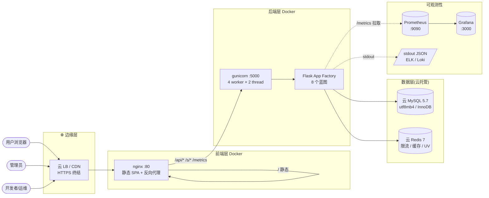
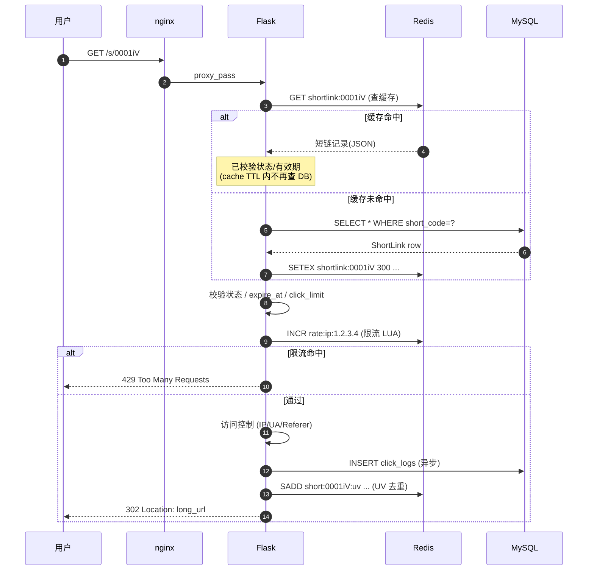
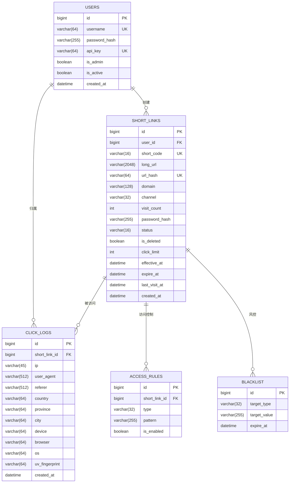
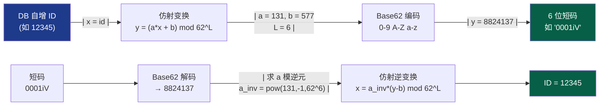
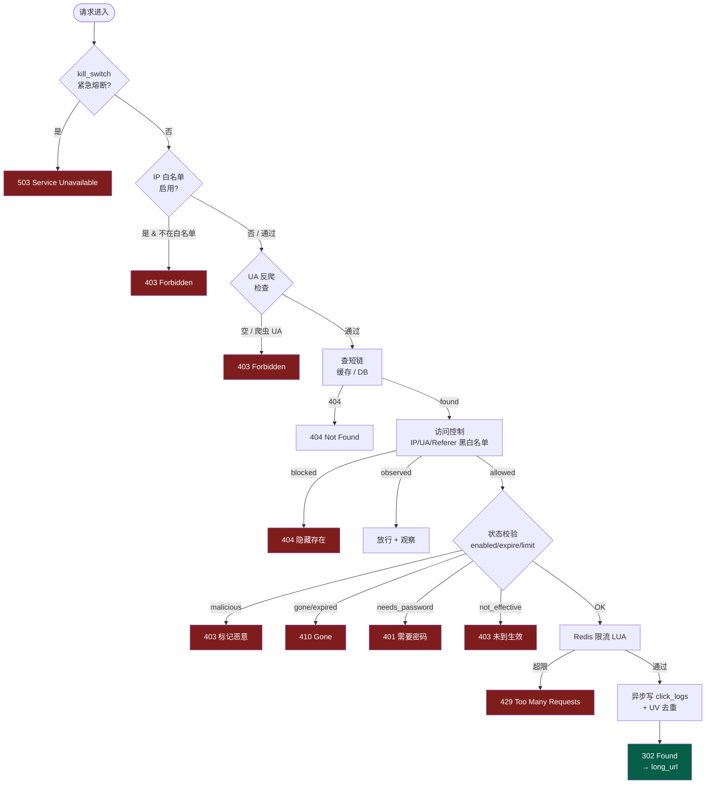
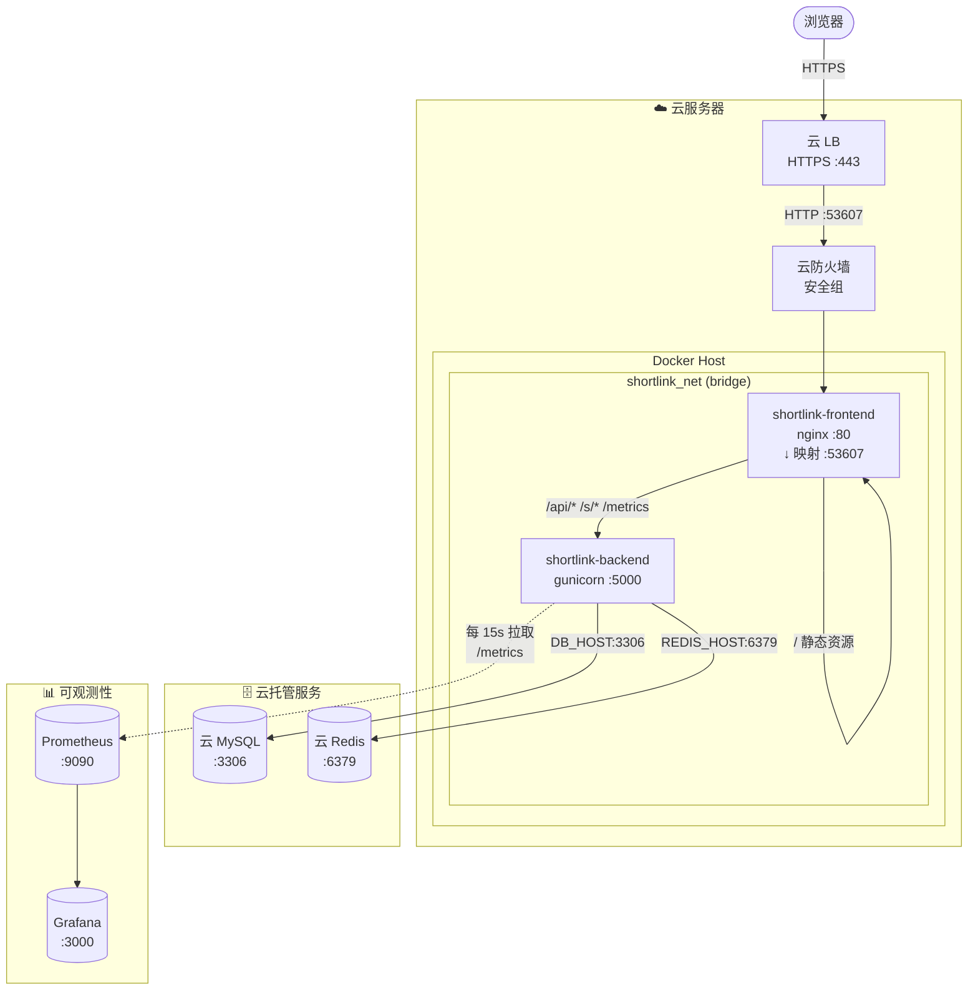
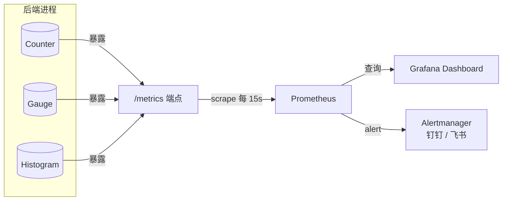
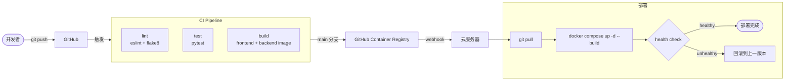
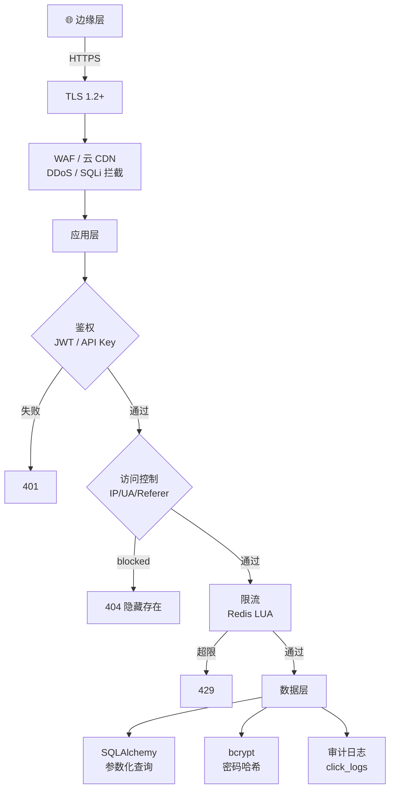

# ShortLink 架构文档(ARCHITECTURE)

> 本文用 mermaid 图描述 ShortLink 的整体架构、请求链路、数据模型、监控与部署拓扑。
> 配套文档:[`PRD.md`](PRD.md)(产品需求) / [`design.md`](design.md)(技术设计) / [`../README.md`](../README.md)(项目主页)。

---

## 1. 系统总览

---

## 2. 请求链路(跳转主路径)

短码跳转 `/s/{code}` 是最高频请求,完整链路:

**关键点:**

- 缓存命中:亚毫秒级返回,DB 不参与
- 限流 LUA 脚本保证原子性,无需 race condition 加锁
- 写日志异步,不阻塞主链路

---

## 3. 数据模型(ER 图)

**索引设计要点:**

- `short_links.short_code` 唯一索引 → 跳转 O(log n)
- `short_links.url_hash` 唯一索引 → 去重
- `(short_links.status, is_deleted)` 复合 → 列表过滤
- `(short_links.expire_at)` → 后台过期扫描
- `(click_logs.short_link_id, created_at)` 覆盖索引 → 趋势聚合不回表

---

## 4. 短码生成算法

**特性:**

- ✅ 可逆:短码 → ID 无需查表(但生产仍会缓存)
- ✅ 可控:`a` / `b` 一改就完全打散,防止爬取
- ✅ 定长:符合作业 6~8 位要求
- ✅ 容量:6 位 ≈ 568 亿 / 8 位 ≈ 218 万亿

---

## 5. 限流与反爬流程

---

## 6. 部署拓扑(生产)

**关键配置项(`docker/.env`):**

| 变量 | 必填 | 示例 |
|---|---|---|
| `BASE_DOMAIN` | ✅ | `https://shortlink.lvhn.top` |
| `SECRET_KEY` | ✅ | `openssl rand -hex 32` |
| `DB_HOST/PORT/USER/PASSWORD/NAME` | ✅ | 云 MySQL 连接信息 |
| `REDIS_HOST/PORT/PASSWORD` | ✅ | 云 Redis 连接信息 |
| `CORS_ORIGINS` | ✅ | `https://shortlink.lvhn.top` |
| `FRONTEND_PORT` | - | `53607`(默认) |
| `GUNICORN_WORKERS/THREADS` | - | `4 / 2`(默认) |

---

## 7. 监控指标(`/metrics`)

系统通过 `GET /metrics` 暴露 Prometheus 格式指标:

**核心指标列表:**

| 指标 | 类型 | Labels | 用途 |
|---|---|---|---|
| `shortlink_created_total` | Counter | `domain` | 累计创建数,按域名分布 |
| `shortlink_redirect_total` | Counter | `status` | 累计跳转数,按结果分类(ok / not_found / expired / rate_limited / malicious / needs_password) |
| `shortlink_cache_total` | Counter | `result` | 缓存命中 / 未命中 |
| `rate_limit_hits_total` | Counter | `scope` | 限流命中(global / link) |
| `http_request_duration_seconds` | Histogram | `method`, `endpoint` | 请求耗时聚合(count / sum / avg / max) |
| `shortlink_count` | Gauge | `status` | 当前短链总数(enabled / disabled / malicious / total) |
| `process_uptime_seconds` | Gauge | - | 进程启动时长 |

**Grafana 推荐面板:**

- **业务**:PV / UV 趋势、Top 10 短链、状态分布
- **系统**:QPS、P50/P95 延迟、错误率
- **告警**:5xx > 1%、限流命中 > 100/min、`malicious` 状态 > 0

---

## 8. CI / CD 流水线

---

## 9. 安全防御纵深

**七层防御:**

1. **TLS** — 云 LB 终结 HTTPS,内部 HTTP
2. **WAF** — 云厂商 DDoS 防护
3. **鉴权** — JWT (HS256) + 过期 + refresh
4. **访问控制** — 业务层 IP / UA / Referer 黑白名单
5. **限流** — Redis LUA 滑动窗口
6. **ORM** — 全参数化,无字符串拼接
7. **审计** — click_logs 留痕,可回溯恶意访问

---

## 10. 文档导航

| 文档 | 关注点 |
|---|---|
| [`README.md`](../README.md) | 项目主页、快速开始 |
| [`PRD.md`](PRD.md) | 产品需求:功能清单、字段、规则 |
| [`design.md`](design.md) | 技术设计:模块、数据模型、接口、安全、性能 |
| [`ARCHITECTURE.md`](ARCHITECTURE.md) | 架构图:本文(全 mermaid) |
| [`作业说明.md`](../作业说明.md) | 作业二规格与本项目对照 |
| [`../docker/README.md`](../docker/README.md) | 云服务部署操作手册 |
